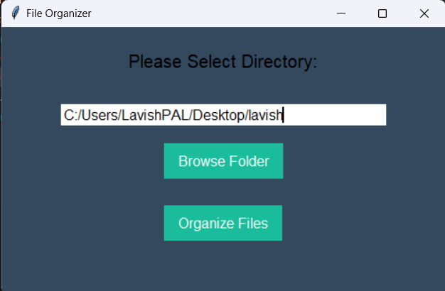

# File Organizer Application

This Python program is a GUI-based tool designed to organize files within a selected directory. It categorizes files by type (e.g., Videos, Audios, Documents) and moves them into appropriately named folders. The program uses the `os` library for file operations and `tkinter` for the graphical interface.

---

## Features

### Automated File Organization:
- Groups files into folders like **Videos**, **Audios**, **Images**, **Documents**, and **Miscellaneous**.
- Moves files to avoid duplication in the destination.

### Cross-Platform Support:
- Detects the operating system (**Windows** or **Linux/macOS**) and uses appropriate file-moving commands.

### User-Friendly Interface:
- Select a folder using a **Browse Folder** button.
- Real-time input of directory paths and instant feedback for errors.

### Modern Design:
- Includes a visually appealing UI with gradients and hover effects for buttons.

---

